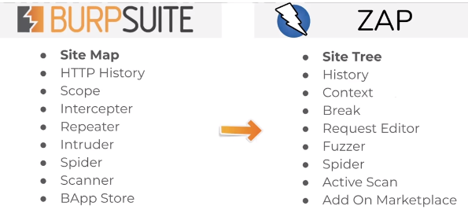

# OWASP ZAP

- Comparison to Burp Suite:
  
- Automated Scan: performs both passive and automated scans to build a sitemap and detect vulnerabilities
  - Traditional Spider:
    - passive scan that enumerates links and directories
    - builds website index without brute-forcing
    - much quieter than brute-force but not as comprehensive as brute-force
  - Ajax-Spider:
    - add-on that integrates in ZAP a crawler of AJAX rich sites called Crawljax
    - can be used in conjunction with traditional spider for better results
    - uses web browser and proxy
    - easiest way to use it is with HTMLUnit
    - To install HTML Unit use the command `sudo apt install libjenkins-htmlunit-core-js-java`
    - then select HtmlUnity from the Ajax Spider Dropdown
