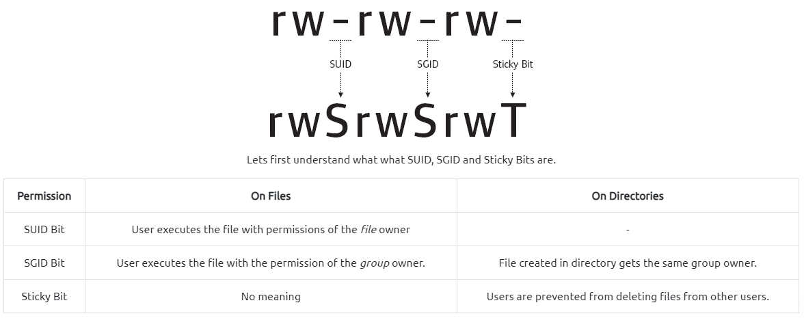

# Linux Commands

## Finding Files

```bash
  # command expression: find command options starting/path expression
  # some examples:
  find /home/username/ -name "*.err"
  # find a file called thisfile.txtin current and subdirectories
  find . -name thisfile.txt
  # Look for all .jpg files in the /home and directories below it
  find /home -name *.jpg
  # Look for an empty file inside the current directory
  find . -type f -empty
  # Look for all .db files (ignoring text case) that have been changed in the preceding 6 days by a user called randomperson
  find /home -user randomperson-mtime 6 -iname ".db"

```

## Installing deb-Packages

```bash
sudo dpkg -i PaketName.deb
```

## (Un-)Zipping Files

```bash
# Unzip \*.tar.gz-files
tar -xf archive.tar.gz
```

## Environment Variables

```bash
# Show environment variables
printenv

# Set new environment variable
export ANT_HOME=/usr/local/apache-ant-1.10.13

# Add new entry to PATH variable
export PATH=${PATH}:${ANT_HOME}bin
```

## Check file hashes for software/data integrity

```bash
md5sum <filename>
sha1sum <filename>
sha256sum <filename>
```

## Get Linux Version

```bash
cat /etc/*release
cat /etc/os-release
lsb_release -d
lsb_release -a
```

## SUID

- "set owner userId upon execution" = particular type of file permission given to a file
- `SUID` gives temporary permissions to a user **to run a program/file with the permission of the file owner** rather than the user who runs it
- this means that the file/files can be run with the permissions of the files owner/group, which could be the super-user
- files need to have the SUID bit set on it `/usr/bin/passwd`

  

  

- to find all SUID files:

  ```bash
  find / -user root -perm -4000 -exec ls -ldb {} \;
  # ...or...
  find / -perm -u=s -type f 2>/dev/null
  ```

- to add SUID bit to a file: `sudo chmod +s bash` (this may be helpful when exploiting e.g. NFS)
