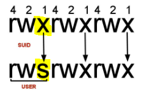

# Linux Commands

## Installing deb-Packages

```bash
sudo dpkg -i PaketName.deb
```

## (Un-)Zipping Files

```bash
# Unzip \*.tar.gz-files
tar -xf archive.tar.gz
```

## Environment Variables

```bash
# Show environment variables
printenv

# Set new environment variable
export ANT_HOME=/usr/local/apache-ant-1.10.13

# neuen Eintrag in PATH-Variable hinten anhängen
export PATH=${PATH}:${ANT_HOME}bin
```

## Check file hashes for software/data integrity

```bash
md5sum <filename>
sha1sum <filename>
sha256sum <filename>
```

## Get Linux Version

```bash
cat /etc/*release
cat /etc/os-release
lsb_release -d
lsb_release -a
```

## SUID

- "set owner userId upon execution" = particular type of file permission given to a file
- `SUID` gives temporary permissions to a user **to run a program/file with the permission of the file owner** rather than the user who runs it
- files need to have the SUID bit set on it `/usr/bin/passwd`
  
- to find all SUID files:

  ```bash
  find / -user root -perm -4000 -exec ls -ldb {} \;
  ```
