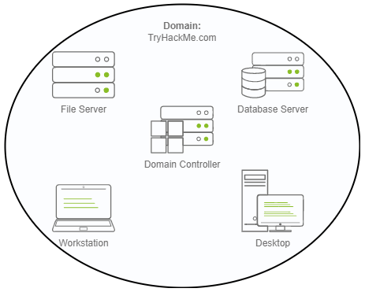
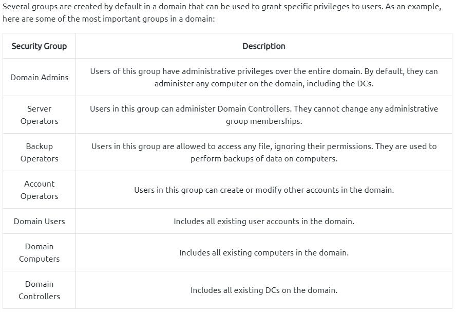
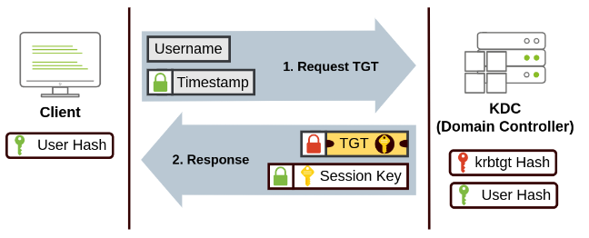
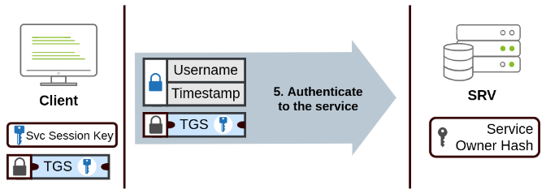
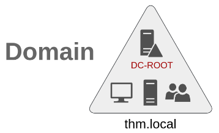
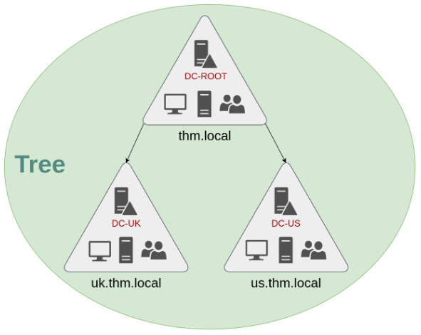
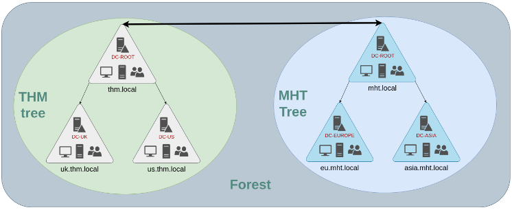

# Microsoft Active Directory (Port...)

- Windows Domain: simply put, a group of users and computers under the administration of a given business
- main idea: centralize administration of common components of Windows Computer network in a single repository called **Active Directory**
- advantages:
  - Centralized Identity Management: all users across network can be configured from AD with minimum effort
  - Centralized Security Policy Management; policies can be applied upon users/computers acress network as needed
- server that runs AD services is known as Domain Controller

- core of any Windows Domain is **Active Directory Domain Service**
  - acts as catalogue that holds information of all objects that exist on the network
    - users, groups, machines, printers, shares etc.
- **Security Groups**

- **Organizational Units**

  - OUs are container objects that allow to classify users and machines
  - mainly used to define sets of users with similar policing requirements
  - a user can only be a part of a single OU at a time

- **Difference OU <--> Security Groups**

  - OUs: handy for applying policies to users and computers --> one user can only be a part of one OU
  - Security Groups: used to grant permissions over ressources e.g. shared folder or network printers --> one user can be apart of many groups (needed to grant access to multiple ressources)

- **Group Policy Objects (GPOs)**

  - configuration and security settings that can be applied to OUs
  - can contain policies aimed either at users or computers
  - configuration in **Group Policy Management** tool
  - any GPO will apply to the linked OU and any sub-OUs under it
  - GPOs are distributed to network via network share called `SYSVOL` which is stored in the Domain Controller
  - all users in domain should have access to this share over network to sync their GPOs periodically
  - this share points to `C:\Windows\SYSVOL\sysvol` directory on each of the Domain Controllers in the network

- **Authentication**

  - two protocols can be used for network authentication in Windows:
    - Kerberos
    - NetNTLM
  - in most environments both protocols are still enabled
  - **Kerberos** --> default in recent versions of Windows

    - Kerberos uses "Tickets"
    - think of tickets as proof of previous authentication
    - Kerberos Authentication process:

      1. user sends username and a timestamp encrypted key derived from password to the **Key Distribution Center (KDC)**
      2. KDC creates and sends **Ticket Granting Ticket** (TGT) along with a session key back to user

      

      3. when user wants to connect to AD service (share, database...) the will use their TGT to ask the KDF for a **Ticket Granting Service** (TGS = tickets that allow connection only to the specific service they were created for)
         1. therefore user send username and timestamp encrypted using the Session Key alongside with the TGT and a **Service Principal Name** (indicates which server name and service is being accessed)
      4. KDC then sends TGS along with **Service Session Key** which will be needed to authenticate to the service we want to access
         1. TGS is encrypted using a derived key from the **Service Owner Hash** (= user or machine account the service runs under)
      5. TGS can then be sent to desired service to authenticate and establish connection

      

    - TGT is encrypted using the **krbtgt** accounts password --> user can't access its contents
    - encrypted TGT includes a copy of session key

  - **NetNTLM** --> Legacy Authentication protocol, kept for compatibility --> should be considered obsolete
    - works using challenge-response mechanism
    - user's password (or hash) is never transmitted through network in this process for security
    - Process:
      1. client sends authentication request to server they want to access
      2. server generates random number and sends it as a challenge to client
      3. client combines their NTLM password hash with the challenge (and other known data) to generate response to the challenge and sends it back to the server for verification
      4. server forwards challenge and response to Domain Controller for verification
      5. domain controller uses challenge to recalculate the response and compares it to the original response sent by client
      6. If both match, client is authenticated; otherwise, access is denied
      7. authentication result is sent back to the server
      8. server forwards authentication result to the client

- **Domains - Trees - Forests**

  - Domain:

    

  - Trees

    - to integrate multiple domains and to partition network into independent manageable units

    

  - Forests

    

  - domains arranged in trees and forests are joined together by **Trust Relationships** --> allows user from Domain A to accesss ressources in Domain B (or even in a domain in another forest)

    - one-way trust relationship: if Domain AAA trusts Domain BBB, this means that a user on BBB can be authorised to access resources on AAA

    

    - two-way trust relationship: users from Domains on both side trust each other
