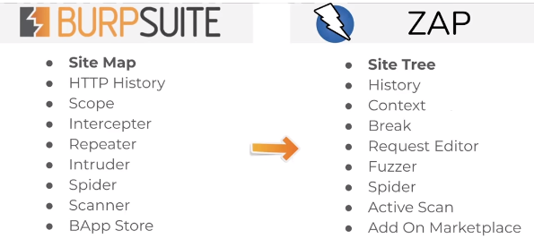
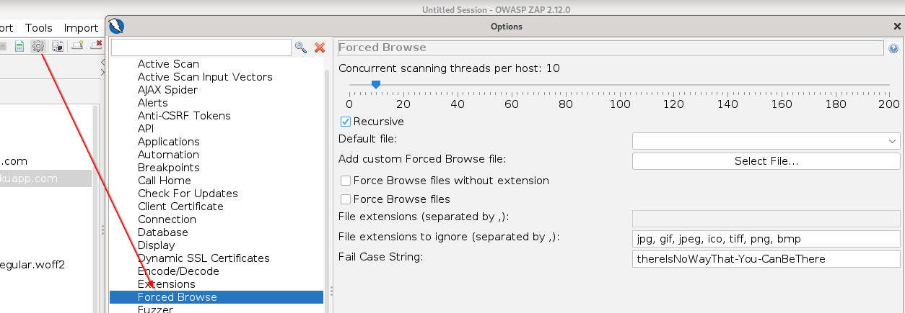
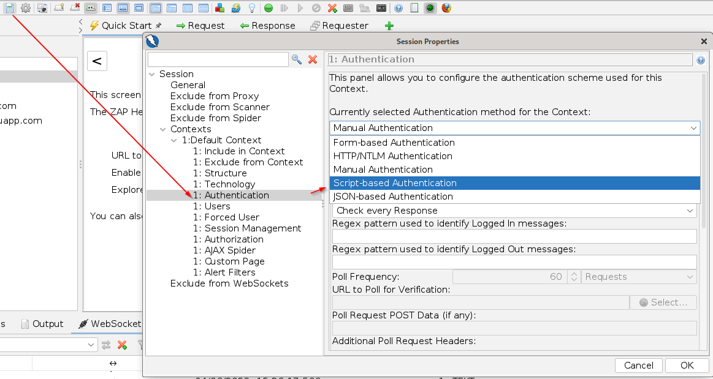
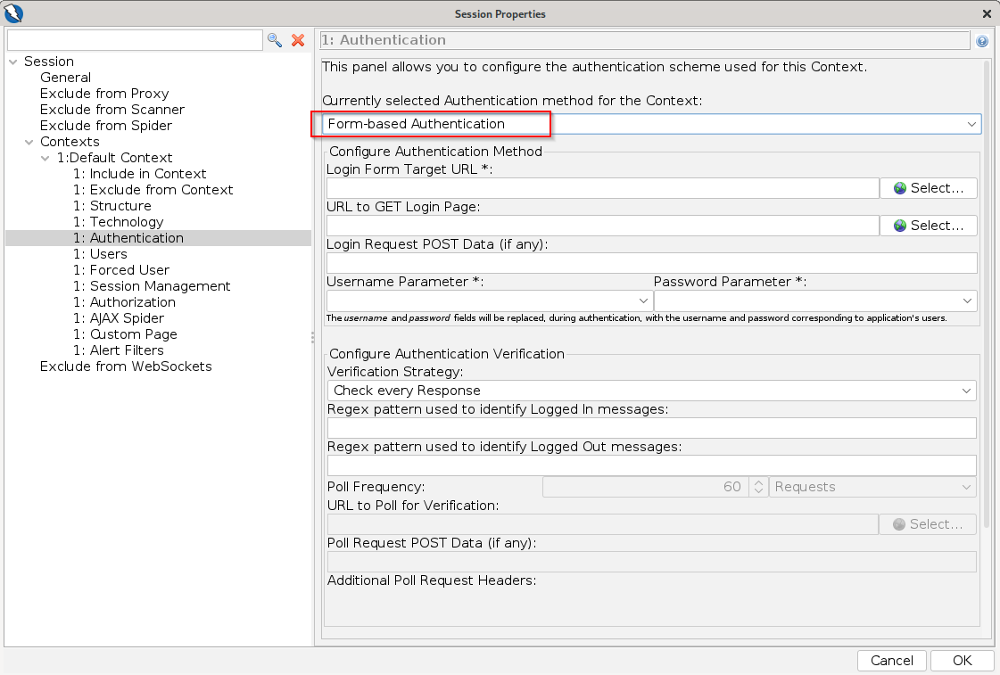
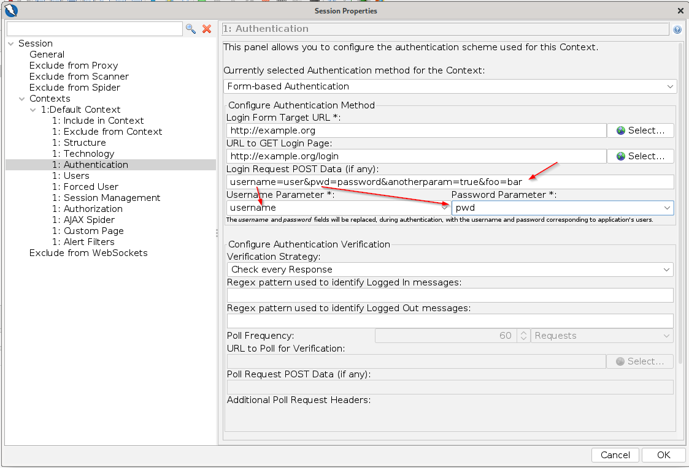
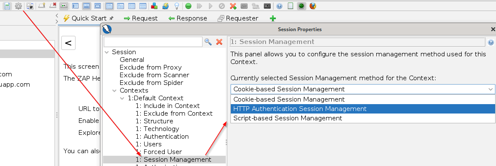
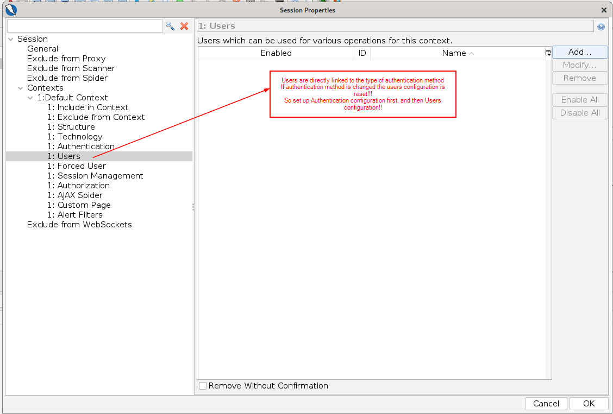
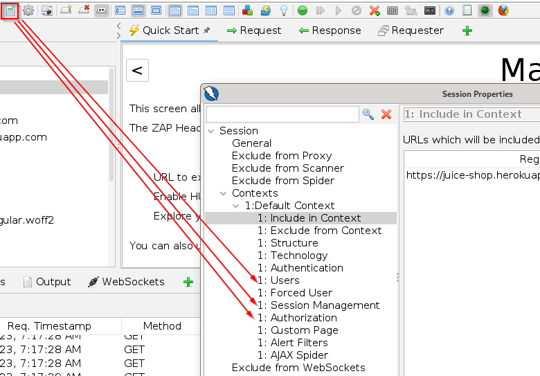

# OWASP ZAP

## Skirmish

- webapp pentest tool:
  - free and open-source!!
  - cross platform (Java)
- Comparison to Burp Suite:

  

- Brute-Forcing using OWASP DirBuster code
- Fuzzing using fuzzdb and OWASP JBroFuzz
- Extensions: <https://github.com/zaproxy/zap-extensions>

## General Information

- Context: a way of relating a set of URLs together --> most commonly represents a web application (or a subset of it)

## Pentest WebApps using ZAP - Best Practice Step-By-Step

1. explore application manually (passive scanner runs through ZAP in the background)
2. add Site from History to Context (either Default Context or create new context)
3. use the spider to find 'hidden' content
4. see what issues the **Passive Scanner** (from step 1) has found
5. use the **Active Scanner** to find vulnerabilities

## Functions and Configurations

### Directory Enumeration (Wordlist Attack)

- ZAP Options --> Forced Browse --> Enumeration Settings
  
- start enumeration:

### (Automatic) Authentication and User Management

- Basics:

  - Authentication: a scheme that defines how a new **Session** is established (user/password, HTTP Auth, OAuth etc.)

    - associated with a context
      
    - most of the time "Form-based"-Auth is necessary:
      
      

  - Session Management: scheme that defines how the Web Sessions are identified by the server and habdled in requests (cookies, query parameters etc.)
    
  - User Management: handles users of web application that can be used for executing actions --> users define actual authentication credentials required in the auth process
    - associated with a context
    - way of defining users depends on the selected authentication method
      

- Authentication, Session and User Management settings can be configured for each context in the **Session Properties**
  

### Scan Types

- Automated Scan: performs both passive and automated scans to build a sitemap and detect vulnerabilities
  - Traditional Spider:
    - passive scan that enumerates links and directories
    - builds website index without brute-forcing
    - much quieter than brute-force but not as comprehensive as brute-force
  - Ajax-Spider:
    - add-on that integrates in ZAP a crawler of AJAX rich sites called Crawljax
    - can be used in conjunction with traditional spider for better results
    - uses web browser and proxy
    - easiest way to use it is with HTMLUnit
    - To install HTML Unit use the command `sudo apt install libjenkins-htmlunit-core-js-java`
    - then select HtmlUnity from the Ajax Spider Dropdown
