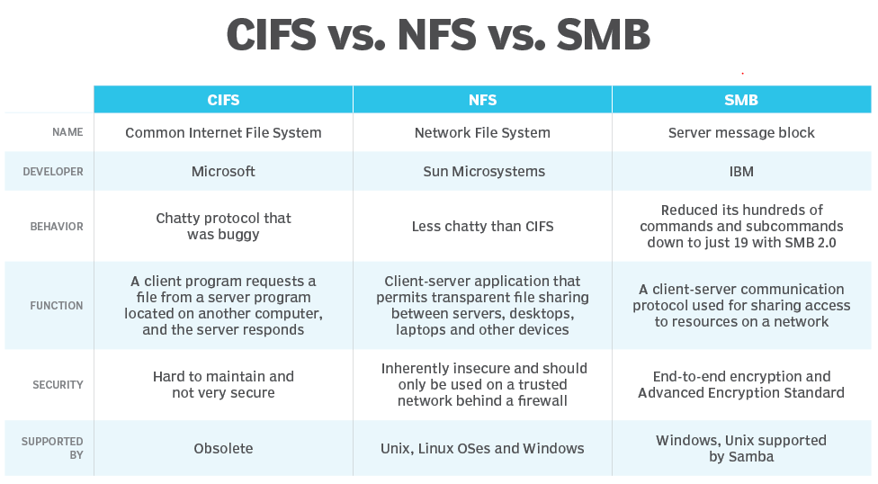

# SMB

- SMB = Server Message Block Protocol
- Ports: 139, 445

  

- client-server communication protocol used for sharing access to files, printers, serial ports and other resources on a network
- response-request protocol:
  - transmits multiple messages between the client and server to establish a connection
  - clients connect to servers using TCP/IP (actually NetBIOS over TCP/IP as specified in RFC1001 and RFC1002), NetBEUI or IPX/SPX
- protocol Dialects:

  

- smbclient: smbclient for Linux;
  - Installation: `sudo apt-get install smbclient`
  - Syntax: `smbclient //[IP]/[SHARE]`
    - followed by the Tags:
      - `-U <username>`
      - `-p <port>`
    - Example: `smbclient \\10.10.10.2\secret -U test -p 445`
    - Testing anonymous access with: `smbclient \\\\<IP/Hostname>\\<ShareName> -U 'Anonymous'`
- enum4linux: **tool to enumerate SMB** shared on Windows and Linux (<https://github.com/CiscoCXSecurity/enum4linux>)

  - Syntax: `enum4linux <options> ip`
  - Options:
    | TAG | FUNCTION |
    | - | - |
    | -U | get userlist |
    |-M | get machine list |
    | -N | get namelist dump (different from -U and-M) |
    | -S | get sharelist |
    | -P | get password policy information |
    | -G | get group and member list |
    | -a | all of the above (full basic enumeration) |

- Examples to enumerate SMB shares and users: `nmap -p 445 --script=smb-enum-shares.nse,smb-enum-users.nse 10.10.236.209`
