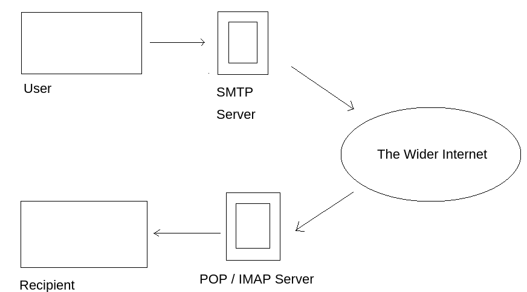
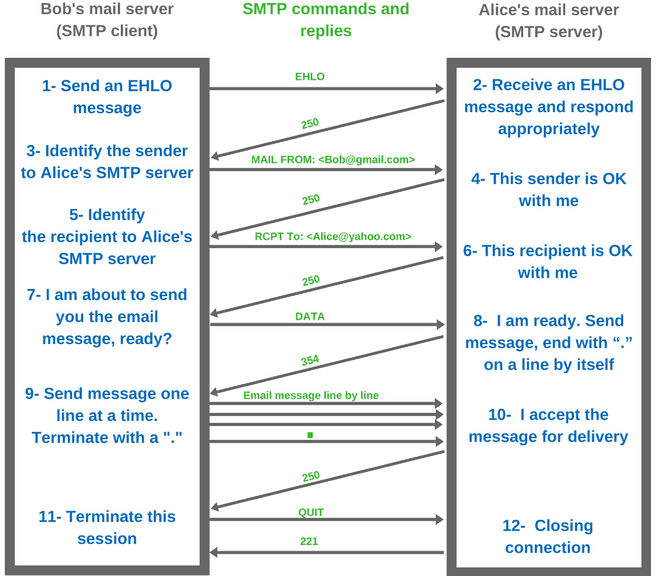

# Simple Mail Transfer Protocol (SMTP; Port 25)

## Random stuff

- utilised to handle the sending of emails
- in order to support email services a protocol pair is required to both send and retrieve mail
  - **SMTP-Server** has three basic functions:
    - verifies who is sending mails through SMTP server
    - sends the outgoing mail
    - if outgoing mail can't be delivered it sends message back to sender
  - **POP (Post Office Protocol) and IMAP (Internet Message Access Protocol**
    - both protocols are responsible for transfer of mail between a client and mail server
    - difference:
      - POP: more simplistic approach of downloading inbox from the mail server to the client
      - IMAP: will synchronize current inbox and download anything new

## How does SMTP work?

- user will supply email and a service
- through a series of steps SMTP will deliver it to recipients inbox
- so SMTP picks up the email and sends it to the recipients server which then directs it to recipient

  

- Simplified Step-By-Step Process:

  1. Mail user agent (email client or an external program) connects to SMTP server of your domain, e.g. smtp.google.com, which initiates the SMTP handshake and the session starts; connection works over **SMTP-Port 25**
  2. Client submits sender, and recipient's email address, the body of the email and any attachments, to the SMTP-server
  3. SMTP-server checks wether domain name of recipient and sender is the same
  4. SMTP-server of sender will make connection to recipients SMTP-server before relaying mail; if recipients sender can't be accessed email gets put into an SMTP queue
  5. on the other side, the SMTP-Server will verify incoming mail and after checking domain and username it will forward email to the POP or IMAP server
  6. Mail will then show up in recipients inbox

  

## Enumeration/Exploitation

- poorly configured or vulnerable mail servers can often provide initial foothold into network
- Enumerating Server Details: before that we need to fingerprint to make targeting as precise as possible e.g. with Metasploit module `smtp-version`
- Enumerating Users from SMTP:
  - SMTP service has two internal commands for enumeration of users:
    - `VRFY` --> confirm names of valid users
    - `EXPN` --> reveals actual address of user's aliases and mailing lists
  - commands can be used manually (e.g. telnet) or automated with e.g. Metasploit
  - another useful tool for this step: `smtp-user-enum`
